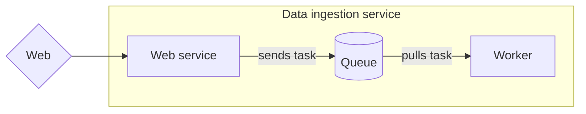
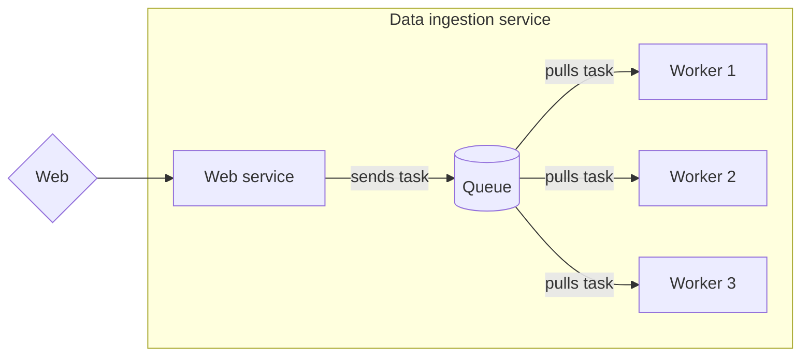
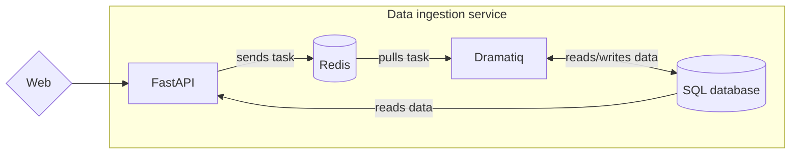

In recent years, Python has gained lot of popularity in the data science community, thanks to the vast ecosystem of libraries covering both the scientific aspect, like pandas or scikit-learn, but also the operational aspect, with highly popular web frameworks like Flask or Django. With one unique language, data scientists are able to embed their experiments and results directly in production-ready applications. In 2018, a new challenger blew up the landscape: [FastAPI](https://fastapi.tiangolo.com/). In less than three years, it has become the #3 most-used web framework, right behind Flask and Django. Its ease of use and intuitiveness rapidly made it the go-to tool for data scientists willing to package their work into powerful REST API.

To convince you, we'll show in this article how to create a reliable data ingestion service, with the help of FastAPI, [SQLModel](https://sqlmodel.tiangolo.com/) and [Dramatiq](https://dramatiq.io/). This service should expose a REST API accepting raw documents in a fast and reliable way, able to handle thousands of documents per second. In the background, it should run some prediction algorithms on those documents' content before saving them into a database.

All the source code is [available on GitHub](https://github.com/frankie567/fastapi-dramatiq-data-ingestion).

## Understand the web-queue-worker architecture

Traditionally, REST API endpoints validate user input, perform some operations and save the data into a database. While this pattern is perfectly working in most applications, we could hit a bottleneck in the context of our data ingestion service: with thousands of documents per second, we can't be sure the web server will be able to handle them fast enough without blocking and take the risk of loosing some documents in the process.

That's why we'll consider here what is generally called the **web-queue-worker** architecture. Basically, the whole application is composed of three things:

* A web service, which is our user-facing API that will accept new data and send tasks to a queue;
* A queue, which will store those pending tasks for later;
* A worker service, which will pull new tasks from the queue and handle them in background.



By doing this, we are **moving all the heavy logic in a background process**, the worker. Hence, the role of the web service is just to validate input and put a new task in the queue. Usually, queues use very fast and efficient technologies, like RabbitMQ or Redis. Hence, the operation inside the API is very quick, allowing the web server to answer the request rapidly; which is highly desirable if we have lot of requests!

The worker can then process the tasks as they come. Even if there are lot of them, it's not an issue: every pending tasks are safely stored in the queue, so we limit the risk of losing data. If we wish to handle the queue more rapidly, all we have to do is to spawn more worker processes that will pull and handle tasks concurrently.



This architecture may sound complex to implement but actually, thanks to FastAPI and Dramatiq, you'll see that we can do it very quickly. Here is the plan:

* Web service will be implemented with FastAPI;
* Worker and task management will be handled by Dramatiq;
* The queue data storage (we say **broker**) will be Redis;
* The actual documents data will be stored on a SQL database. The communication with this database will be handled by SQLModel.



## Define the SQLModel models

Before anything else, let's define the data models for our application. As we said, we'll use the SQLModel library to help us with that. SQLModel is a brand-new library by the creator of FastAPI, which combines the power of Pydantic models, already at the heart of FastAPI, and SQLAlchemy, the unavoidable SQL library for Python. It allows us to define our SQL data with standard Python classes and type annotations. Let's see it in action:

```py
import uuid
from datetime import datetime
from typing import Optional

from pydantic import UUID4
from sqlmodel import Field, SQLModel


class DocumentInput(SQLModel):
    id: UUID4 = Field(default_factory=uuid.uuid4, primary_key=True)
    content: str


class Document(DocumentInput, table=True):
    created_at: datetime = Field(default_factory=datetime.utcnow)
    updated_at: datetime = Field(default_factory=datetime.utcnow)
    category: Optional[str] = Field(default=None)

```

We define two models: `DocumentInput` and `Document`.

The first one will be the data structure accepted by our REST API. The great thing about FastAPI and Pydantic models is that data validation is already covered: if a property is missing or doesn't have the right type, FastAPI will automatically generate a proper error response. Here, we define two properties: `id` and `content`, which will bear the raw content of the document.

We chose to use UUID instead of a classic auto-increment number as primary key. It's an interesting pattern in this context because the client can set the id by itself; which may be useful if we need to send an updated version of the same document. If we relied on an auto-increment identifier, we would need first to make a request to retrieve it or save it somewhere else.

The second one, `Document`, is the actual data structure for our SQL database (notice the `table=True` argument). It inherits from `DocumentInput` to which we have added creation/update dates and a **category field**. This category will be **determined automatically during data ingestion** thanks to a machine learning model.

## Implement the worker

Let's now have a look at the worker. Basically, it's a Python module containing all the tasks that will be handled by Dramatiq. We also initialize here the various parameters for Dramatiq, especially the broker. Here is how it looks like:

```py
from app.predict import CategoryPrediction
from datetime import datetime

import dramatiq
from dramatiq.brokers.redis import RedisBroker
from sqlmodel import Session

from app.db import engine
from app.models import Document, DocumentInput
from app.settings import settings

redis_broker = RedisBroker(url=settings.redis_url)
dramatiq.set_broker(redis_broker)


category_prediction = CategoryPrediction()


@dramatiq.actor
def ingest_document(document_json: str):
    document = DocumentInput.parse_raw(document_json)
    with Session(engine) as session:
        document_db = session.get(Document, document.id)
        if document_db is None:
            document_db = Document(**document.dict())
        else:
            document_dict = document.dict(exclude_unset=True)
            for key, value in document_dict.items():
                setattr(document_db, key, value)

        document_db.category = category_prediction.predict(document_db.content)
        document_db.updated_at = datetime.utcnow()

        session.add(document_db)
        session.commit()
```

The first thing to notice is that we set the broker to be Redis and specify the URL of the server.

Then, we have our task definition. As you can see, it's a standard Python function upon which we added the `@dramatiq.actor` decorator. It receives in argument a JSON representation of a `DocumentInput`. Indeed, we can't pass directly Python objects because Dramatiq needs to serialize them before saving into the broker. That's why we first deserialize it back again into a proper `DocumentInput` object.

Next, we first check if we don't already have a document with the same id in the database. This way, we can update it or create a new one if needed. `session` and `engine` are SQLModel tools used to communicate with the database. You can read more about how it works in [the official documentation](https://sqlmodel.tiangolo.com/tutorial/one/#select-by-id-with-get).

### Add a machine learning model to predict category

Actually, the most important step in this function is the category prediction. You can see that we use a `CategoryPrediction` class for this purpose. This utility class allows us to load a model that have been trained previously in scikit-learn. In this example, this is a simple [Multinomial Naive Bayes classifier](https://scikit-learn.org/stable/modules/naive_bayes.html#multinomial-naive-bayes) trained on [the 20 newgroups text dataset](https://scikit-learn.org/stable/datasets/real_world.html#newsgroups-dataset).

The purpose here is not to provide a very powerful model for classifying documents but rather to show you how you can integrate a scikit-learn estimator into a data ingestion service. By putting this operation in a worker process, like here, we can imagine even very expensive algorithms to apply on our documents: it won't break our system.

Here is how this class looks like:

```py
import os
from typing import List, Optional, Tuple, cast

import joblib
from sklearn.pipeline import Pipeline


class CategoryPrediction:
    model: Optional[Pipeline] = None
    targets: Optional[List[str]] = None

    def load_model(self):
        """Loads the model"""
        model_file = os.path.join(os.path.dirname(__file__), "newsgroups_model.joblib")
        loaded_model: Tuple[Pipeline, List[str]] = joblib.load(model_file)
        model, targets = loaded_model
        self.model = model
        self.targets = targets

    def predict(self, input: str) -> str:
        """Runs a prediction"""
        if self.model is None or self.targets is None:
            self.load_model()
        model = cast(Pipeline, self.model)
        targets = cast(List[str], self.targets)
        prediction = model.predict([input])
        return targets[prediction[0]]
```

This class has two methods: the first one to load a dumped model with [Joblib](https://joblib.readthedocs.io/en/latest/). This library allows us to dump arbitrary Python objects in a file on disk, like a trained scikit-learn estimator. This way, we can load it again on our production service and use it right away to perform predictions.

The second method actually perfoms a prediction on an input string. Since the loaded object is a true scikit-learn estimator instance, we can use it like usual. Notice that we load the model *lazily*: it's not loaded until we perform our first prediction. Since loading the model can be quite expensive, we don't want the startup of our worker process to be slowed down by this operation.

## Implement the REST API

It's now time to implement the REST API that will accept new documents. By using the models we defined before, you'll see that FastAPI allows us to implement an endpoint with proper input validation in no time. Here is how the *whole* application looks like:

```py
from fastapi import FastAPI, HTTPException, status
from pydantic import UUID4
from sqlmodel import Session

from app import models
from app.db import create_db_and_tables, engine
from app.worker import ingest_document

app = FastAPI()


@app.post(
    "/documents",
    status_code=status.HTTP_202_ACCEPTED,
    response_model=models.DocumentInput,
)
def add_document(document: models.DocumentInput):
    ingest_document.send(document.json())
    return document
```

Yes. You don't need any more line to make your API working. That's the beauty of FastAPI: just by using the proper type hint in your function argument, the framework will validate that the request payload should contain a JSON object structured following a `DocumentInput`.

All we have to do then is to import the `ingest_document` task from our worker module and `send` a new task in the queue. Notice that we serialize the object in JSON before. At that point, the document is sent in the Redis queue and will wait to be handled by the worker.

And that's all! By keeping it very simple, our endpoint will be able to handle thousands of requests without any problem.

## Deploy on Heroku

Our service is ready! It would be nice if we could try it, right? Actually, we can deploy it for free in just a few minutes! We'll use [Heroku](https://www.heroku.com/), one of the leading serverless platforms. The main benefit of those kind of platforms is that you don't have to manage a server yourself: you just configure your application and send the source code. The platform takes care of deploying it and make it available to the whole world!

The first step before deploying to Heroku is to create a `Procfile`. This is a special file for Heroku that defines what processes you need and how to run them. It looks like this:

```
web: uvicorn app.api:app --host 0.0.0.0 --port $PORT
worker: dramatiq app.worker
```

As we said before, we have two main processes:

* The web process, i.e. our FastAPI application. On Heroku, a process named `web` means it's a process that needs to be accessible through the web and routed accordingly. On the right, we have the command the platform should run to start the FastAPI application. [Uvicorn](https://www.uvicorn.org/) is a web-server able to work with ASGI applications, the standard Python protocol for asynchronous web applications like FastAPI. The first parameter is the import path towards our FastAPI app variable.
* The worker process, which is run by Dramatiq. Simply, we use the `dramatiq` command and pass the import path of our worker module.

What about Redis and the SQL database? In Heroku, you can attach external services that will be entirely managed by the platform or third-party providers. Those are the add-ons, and Heroku proposes ones to have Redis and PostgreSQL servers. We'll see how to add them in a minute.

Heroku applications can be managed through their web interface or their CLI tool. We'll show you how to deploy the application with the CLI tool. First of all, create a new Heroku account and [install the CLI](https://devcenter.heroku.com/articles/heroku-cli).

Once done, the first thing to do is to create a new app:

```bash
heroku apps:create fastapi-data-ingestion --region=eu
```

This will create an app named `fastapi-data-ingestion` in the European data center.

Heroku stores and updates your application source code through a standard Git repository. To do this, it sets a special remote in your Git repository: when you push on this remote, Heroku automatically deploys a new version of your application. The following command will setup the remote URL for your app in your current Git repository:

```bash
heroku git:remote -a fastapi-data-ingestion
```

Great! Let's now add a Redis and a PostgreSQL add-on on the free plan:

```bash
heroku addons:create heroku-redis:hobby-dev
heroku addons:create heroku-postgresql:hobby-dev
```

The nice thing about add-ons is that they **automatically set environment variables** with the right authentication information. Those environment variables are available in your application and can be used directly to connect to those services. You can check the defined environment variables for your application with the following command:

```bash
heroku config
```

You'll get an output like this:

```
=== fastapi-data-ingestion Config Vars
DATABASE_URL:  postgres://********************************
REDIS_TLS_URL: rediss://********************************
REDIS_URL:     redis://********************************
```

Everything is ready! All we have to do now is to push our code to the Heroku remote to start a deployment. Let's go:

```bash
git push heroku main
```

The deployment will take a few minutes. You'll see in the output all the operations Heroku performs, especially the installation of Python dependencies: don't forget to define your `requirements.txt`!

Once done, there is one last thing to do. By default, Heroku doesn't start processes other than `web`. The following command will start the worker process:

```bash
heroku ps:scale worker=1
```

That's it! Our data ingestion service is up and running! Wanna try it? Let's send a document into our REST API:

```bash
curl --header "Content-Type: application/json" \
  --request POST \
  --data '{"content":"computers are awesome"}' \
  https://fastapi-data-ingestion.herokuapp.com/documents
```

You'll get the following result:

```json
{"id": "179611c1-a124-4403-905d-0f0dbe7e6d28", "content": "computers are awesome"}
```

An id has been generated for our new document. How to be sure that it has been properly handled by our worker process? We've implemented another API endpoint to retrieve a saved document. Let's try it:

```bash
curl https://fastapi-data-ingestion.herokuapp.com/documents/179611c1-a124-4403-905d-0f0dbe7e6d28
```

Which should give you:

```json
{
    "id": "179611c1-a124-4403-905d-0f0dbe7e6d28",
    "created_at": "2021-09-01T12:10:51.738076",
    "updated_at": "2021-09-01T12:10:52.085624",
    "category": "comp.sys.mac.hardware",
    "content": "computers are awesome"
}
```

Awesome! Our document *is* in the database and a category have been predicted for it.

## Final thoughts

Congratulations! You now know how to implement the web-queue-worker architecture in Python using FastAPI, Dramatiq and SQLModel. As you've seen, those technologies help you implement this pattern in no time thanks to an easy-to-use and readable syntax. With this kind of service, you'll be able to handle a large stream of documents and apply expensive machine learning algorithms, like here with a scikit-learn estimator, without compromising the stability of the application or the data integrity.

I hope you liked this quick walkthrough and that it gave you ideas for your next projects. If you wish to go further and master FastAPI to build efficient and reliable data science applications, you can check my book **Building Data Science Applications with FastAPI**, which is available in e-book and paperback on [Amazon.com](https://www.amazon.com/gp/product/B09926TFQ5). Here is what you'll learn:

* The concepts of the FastAPI framework, including aspects relating to asynchronous programming, type hinting, and dependency injection
* Develop efficient RESTful APIs for data science with modern Python
* Build, test, and deploy high performing data science and machine learning systems with FastAPI

[](https://www.amazon.com/gp/product/B09926TFQ5)

See you soon 👋
