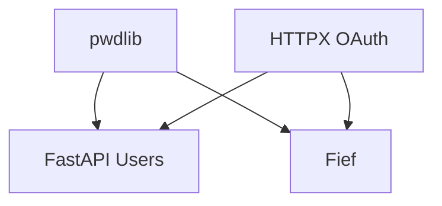
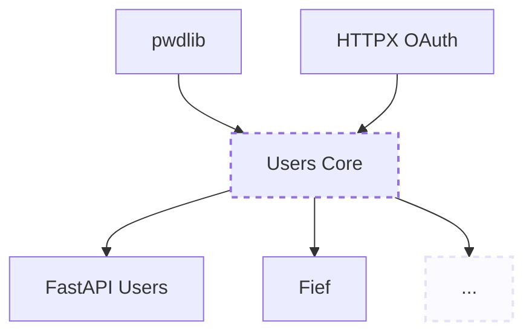

Four years ago, I've made the [first commit](https://github.com/fastapi-users/fastapi-users/commit/4e0b0f6f7d58b55fade54fceea74d2aaa867a17e) to [FastAPI Users](https://github.com/fastapi-users/fastapi-users). At that time, all I wanted was a simple solution to manage users authentication in a FastAPI project. I didn't really have any specific experience in this field, other than what I knew from what other web frameworks like Django did.

Over time, this project grew in popularity and, to my own surprise, I started to actually *like* all the problematics and challenge related to authentication. Quickly, I created other related projects, like [httpx-oauth](https://github.com/frankie567/httpx-oauth) before tackling a very big challenge, [Fief](https://www.fief.dev/).

I don't think it's necessary to explain you why, in this kind of projects, it's critical to [hash users passwords](https://cheatsheetseries.owasp.org/cheatsheets/Password_Storage_Cheat_Sheet.html#background). It's actually fun to see that the first commit of FastAPI Users already has a function to hash passwords using [`passlib`](https://foss.heptapod.net/python-libs/passlib).
This part hasn't changed much since, and you can find a [very similar impIementation](https://github.com/fief-dev/fief/blob/8bd6666f9c492b107f72762e88263d2bb7de2e92/fief/crypto/password.py) in Fief. For years, `passlib` has been the de-facto standard to hash passwords in Python, thanks to its wide algorithms support and well-designed helpers.

However, today, let me introduce you [`pwdlib`](https://github.com/frankie567/pwdlib), a modern password hash helper for Python.

# Why `pwdlib`?

To my great regret, `passlib` has not been very active recently and its [maintenance status is under question](https://foss.heptapod.net/python-libs/passlib/-/issues/187). Starting Python 3.13, unless it's updated, `passlib` won't work anymore.

Currently, it's a [major blocker](https://github.com/fastapi-users/fastapi-users/issues/1325) for FastAPI Users and probably for a lot of other projects too.

That's why I decided to start `pwdlib`, a password hash helper for the modern Python era. However, it's **not designed to be a complete replacement** for `passlib`, which supports numerous [hashing algorithms and features](https://passlib.readthedocs.io/en/stable/lib/index.html).

**✅ Goals**

- [x] Provide an easy-to-use wrapper to hash and verify passwords
- [x] Support modern and secure algorithms like Argon2 or Bcrypt

**❌ Non-goals**

- [ ] Support legacy hashing algorithms like MD5
- [ ] Implement algorithms directly — we should only rely on existing and battle-tested implementations

# Quickstart

The first version I release today supports Argon2 and Bcrypt, and exposes a convenient helper to hash and verify passwords.

```sh
pip install 'pwdlib[argon2]'
```

```py
from pwdlib import PasswordHash

password_hash = PasswordHash.recommended()
hash = password_hash.hash("herminetincture")
password_hash.verify(hash, "herminetincture")  # True
```

If you wish to know more, make sure to [read the documentation](https://frankie567.github.io/pwdlib/).

#	What now?

The first step will be to use it in FastAPI Users and Fief, and adjust the API if needed given the needs and field experience.

I'm also considering to support other common algorithms, like `scrypt`, which is the second choice after Argon2; following [OWASP recommendations](https://cheatsheetseries.owasp.org/cheatsheets/Password_Storage_Cheat_Sheet.html#introduction).

But I also have more global ambitions!

# Building an ecosystem dedicated to users authentication

Currently, projects I maintain are roughly structured like this:



There are actually lot of duplicated logic in both FastAPI Users and Fief, and some that would be super-interesting to have access to on their own, without being tied to a framework or software.

My ultimate goal would be to create a `users-core` library (name to be confirmed): a sans-IO project which would expose all the logic and protocols for users authentication: registration, password reset, social connect, passkeys, OpenID Connect, etc. Those implementations could then be used regardless of the framework, whether it's FastAPI, Starlette or Django.



I'm very excited about this vision! This is something I have in mind for quite a time now and I really believe it'll help the Python community to build web projects faster, with rock-solid authentication foundations!
